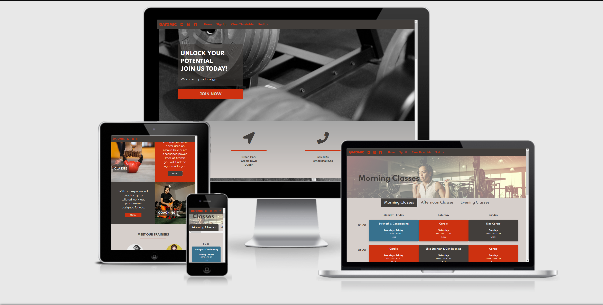

# Atomic Fitness



***
This will be a static, single-scrolling website to promote a local gym.

In this project, I shall experiment with Bulma, and endeavour to create an attractive and responsive website using html & css and minimal javascript.

Deploying bold, energetic colours with sleek fonts and intuitive user-experience, the site will supply information to existing members whilst providing an easy entry point for new and potential members. Key parts of the site will be a landing page detailing the various classes, profiles of the gym instructors, a sign-up form and a weekly time-table.
***

## [Link to Live Site](https://chrisshortlaw.github.io)

## TABLE OF CONTENTS

1. [UX](#UX)

    a. [User Epics](#product-owner-epic)
    b. [The Ideal User](#the-ideal-user)
    c. [User Stories](#user-stories)

2. [Development](#development)

    a. [Strategy](#strategy)
    b. [Scope](#scope)
    c. [Structure](#structure)
    d. [Skeleton](#skeleton)

3. [Design](#design)
4. [Features](#features)
5. [Technologies Used](#technologies-used)
6. [Testing](#testing)
7. [Notable Bugs](#notable-bugs)
8. [Deployment](#deployment)
9. [Credits](#credits)

***

## UX

### Product Owner Epic

Mark, Owner of Atomic Fitness

> I opened Atomic Fitness in 2015. 
> The gym has been successful through word-of-mouth and an active social media presence (facebook, twitter & instagram).
> We offer classes as well as personal training (group and one-to-one).
> Yet, some larger fitness chains have opened in the locality over the past two years.
> This coincides with the completion of several new housing estates and apartment complexes.
> This means an influx of newcomers to the area and increased competition for their business along with regulars being attracted to competitor gyms.
> I want a website to attract new clients. I need a slick design to compete with the larger franchises and brand-names.
> Our gym is class-based which appeals to those who are new to fitness or would be uncomfortable working out on their own.
> A unique selling point is that the gym is well-situated in a local park which is walking distance for most people.
> There is also ample parking. I want to communicate this convenience and unique locale whilst also presenting a product that is stylish enough to match the larger competition.
> The goal here is to reach a wider audience than social media, achieve more sign-ups and participation in challenges.
> I would also like to up-sell existing clients from regular classes to personal training.
> Most members pay by cash in person but I would like the ability to take payments over the site in the future.
> Most member also use their phones for facebook & instagram and would probably browse my website on mobile too.
> Consequently, good design for mobile screens is a must.

### User Epic - Marie

> I have been going to Atomic Fitness for 6 months.
> I find using facebook and instagram for discovering information about the gym to be inconvenient. Sometimes it is hard to tell what is old, expired content and what is still relevant.
> I want a website where I can check the weekly class schedule for the gym.
> I would primarily view the site on my mobile phone.

### User Epic - Martin

> I am new to the area and want to explore what amenities are nearby like gyms and parks.
> I dislike social media as I am concerned about my privacy and I do want to be tied to using multiple apps on my phone or tablet.
> I discover information about my local area by using a search engine
> I would want any website to tell me where the gym is and what services it offers.
> I would be more likely to sign up if there was an easily accessible and convenient way online.

### The Ideal User

- Is a gym member, or
- Is a prospective gym member

### User Stories

- As a user, I want to view what services this gym offers so I can decide if it offers what I want;
- As a user, I want to be able to see the time-table of gym classes so I may attend them;
- As a user, I want to view what trainers work at the gym so I can see who teaches at the gym;
- As a user, I want to use the site on mobile and navigate it easily so I can access the content I want when I want it;
- As a user, I want to have a means to contact the gym so I can get more information;
- As a user, I want to view where the gym is located so I can get there;
- As a user, I want to view pictures of the gym;
- As a user, I want a sign-up page;

***

## Development

### Strategy

The target audience will be consumers, gym-goers, living in the local area. The user epics from the gym owner and the customers above, together with the user stories which were created from them, provided the blueprint for the design and feature-set of the site.

Of primary importance were the development of responsive, mobile-first webpages. Both the gym owner and the users anticipated they would access the site from a mobile device.

The site would appeal to these two kinds of people in different ways. Existing customers would use the site as an easy method to check class times, get information about the gym. The site would also 'reassure' members of the professionalism and quality of the gym experience and would aim to prevent people switching to frequenting a larger gym chain.

New customers will be seeking information about the gym and should be enticed to explore the site further through its slick design.

User Demographics & Roles:

- Existing Customers:
  - Age Breakdown:
    - under 18: 5%
    - 18 - 35: 55%
    - 35 - 50: 30%
    - Over 50s: 10%
  - Are gym goers into fitness
  - Intend to continue frequenting a gym

- New Customers:
  - Age Breakdown:
    - More likely to come from 18 - 35 and 35 - 50 categories
    - Are interested in joining a gym

### __Website should allow the User__

- [x] To obtain information about:
  - [x] Class times
  - [x] Gym location
  - [x] Gym contact details
  - [x] Details of Gym services
  - [x] Links to social media accounts for the Gym
- [x] To be accessed on their mobile phone
- [x] To sign up to the gym, 
- [] To manage their subscription to the gym
- [] To make payments to the gym

#### __Website should allow the Product Owner__

- [x] To develop an online presence
- [x] Compete with larger gym chains in the online domain
- [x] Provide information to users
- [x] Provide a website that has a familiar user experience but still remains individual
- [x] Provide a website that can be traversed quickly and easily
- [x] Maintain continuity with existing social media presence
- [] To operate and manage online subscriptions
- [x] To offer a way of signing up to the gym.
- [] To offer a way of paying online

Taking this into consideration, each goal was assessed for importance and viability.

It was deemed that the goals themselves were all viable and of roughly equal importance. The expectation was that, following introduction of the website, existing users might be transitioned to using it as their primary method of payment and subscription maintenance. The Product Owner noted that previous attempts to use web or mobile phone based apps had not met with great success as many members still wished to pay in person with either cash or card. However, card payments had been steadily rising and the development of an online presence might lead to a greater number of customers switching to online payment. Consequently, this goal was placed lower on the importance scale and was agreed to be implemented at a later stage.

The viable and important upon goals to be met by this project were marked with an x above. Goals that were to be left to a future date are unmarked.

## 2. Scope

Having settled upon the goals, the scope of the project was set out. These were split into content and functionality.

### Content

- Users will expect:
  - Information about the location of the gym
  - Images of the gym
  - Information about how to contact the gym
  - Information about the gym's services
  - Information about the trainers who work at the gym
  - Links to the gym's social media
  - Information about class times
  - A method of signing up to the gym
  - Information from customers about what using the gym is like

### Functions

- The site must be quickly navigable
- The site must be simple to traverse
- The key parts of the site must be easy to find and access
- The site must be fully featured on a mobile phone
- The site must be responsive on all screens and media

## Structure

  The structure of the site is as follows:

  

At its heart, the site structure is a simple-tree which will be made traversible on mobile via the use of a 'burger' menu. This ensures quick navigation for frequent users whilst also allowing new visitors to gain more information. Navigation commences on the Landing page, a long scroller with several sections. New visitors are informed of the characteristics of the gym and supplied with media content whilst being gently directed towards the sign-up page. Experienced visitor can move to where they gain the most information.

## Skeleton

[Wireframes](/assets/wireframes/ci-atomic-fitness.pdf) were created with [Figma](https://www.figma.com).

### Wireframes

[Wireframes](/assets/wireframes/ci-atomic-fitness.pdf)

A mock up was built using Figma. Colour theme was generated with Coolors. 

***

## Design

### Typography

A pairing of Spartan and Montserrat was used through. Spartan geometric shape projects strength, especially at heavier weights. Montserrat, by contrast, is a lithe and elegant type providing an excellent contrast and complimenting the sites theme and content.

### Colour

The colour theme of the site is focussed on three colours: Light grey (#D6CFCB), Dark Grey (#423E3B) and deep orange (#CD3110). As layout would be familiar to users of other gym websites, the use of colour would differentiate the site and would stand out compared to the often muted colours deployed by others.

### Images

Where possible, images were selected to match the colour scheme and to add to the 'mood'. To ensure accessibility, images were not used to convey any content. All images were sourced from open source websites and are free to use. Attribution is given in the [credits](#Credits) below. Where the colour scheme of the images did not match or was deemed to distract from content, an image editor (Inkscape) was used to apply a greyscale filter.

### Glassmorphism

To add an additional styling, the glassmorphism effect was deployed. This effect creates a translucent container and applies a subtle blur to any background images over which it lies. The upshot goves the appearance of frosted glass and enhances any sense of depth on the image or screen. Glassmorphism is compatible with most modern browsers, but it is disabled by defautl on Firefox. The effect was designed to be subtle so not to create visual noise and distract from content and Firefox users suffer little diminution in experience. 

## Features

### Existing Features

The user epics from the gym owner and the customers above, together with the user stories which were created from them, provided the blueprint for the design and feature-set of the site.

Of primary importance were the development of responsive, mobile-first webpages. Both the gym owner and the users anticipated they would access the site from a mobile device.

Flowing from this, the design focus had to be on fewer features to accommodate a smaller screen but which themselevs were aesthetically pleasing and projected a professional image.

The gym own wanted a site which could compete with other, professionally designed websites of larger gym chains. It was decided that the site would employ a continuity of user experience with other such [websites](#acknowledgments) whilst using a unique color-scheme and theme to allow the webpages some individuality.

### __Landing Page: Hero & Location Information__

It was decided the landing page would be a single scrolling page with multiple sections. A fixed navbar permits easy navigation of the site as the user scrolls. The user is greeted with a hero image which introduce the color scheme: a light grey (#D6CFCB), a dark grey (#423E3b), and a deep orange (#CD3110).

The background images of the hero, and the image below it, are [pictures](#media) to which a greyscale filter was applied using Inkscape. The images remain fixed when scrolling producing parallax and the illusion of depth in the page. Both images are separated by a minimalist 'location and contact' section, the sparseness of which further emphasises the images and effect on display.

### __Landing Page: Client Quotes__

This section has is headed 'client quotes' and contains endorsement from existing clients along with headshots. On mobile, this is single column, exapnding to two columns on large tablets and above. The section uses Bulma's built in columns and section layouts to provide generous padding and to properly centre the content.

### __Landing Page: Services__

This section outlines the services the gym provides with links to the classes and sign up pages. Appearing as a single column on mobile, CSS Grid is used to re-configure the layout on larger displays.

### __Landing Page: Meet The Trainers__

Columns are used again to space out images and descriptions. The columns are, in turn, wrapped ina container to center them in the page.

### __Footer__

A simple solid colour, dark grey (#423E3B) forms the background. The brand logo and name are centred and coloured in deep orange (#CD3110). Below this there are links to a privacy policy (this link has not been implemented), sign up and classes, as well as social media links.

### __Classes__

The Classes page(s) are comprised of three separate sections for morning, afternoon and evening. Each of these section displays time table outlining the classes on Weekdays, Saturdays, and Sundays. Rather than use a  HTML table, which can look awkward on mobile, Bulma's tile layout was recruited. The tiles are responsive, collapsing to a single column on mobile. Users who wish to switch between morning, afternoon and evening may do so by selecting the appropriate tab which are dispayed above the time-table.

### __SIGNUP__

Sign Up is split between two columns. One contains a HTML form, input fields, checkboxes and a submit button. The second column contains a google maps frame where users can see the location of the gym.

#### __INDEX.HTML__

1. NavBar - Allows users to navigate the site, fixed to top of screen so users always have means of navigation, provides useful outline of site and sections.
2. Landing Page: Hero & CTA. Hero image reinforces color theme, call to action includes a button linking users to sign up page.
3. Section - Location & contact section
4. Section - Customer Quotes
5. Sections - Services: Classes & Personal Training
6. Section - Meet Our Trainers
7. Footer

##### LANDING PAGE

Landing page: users can scroll a single page with bright title/hero image, callouts for promotions & challenges, quotes from happy members, scrolling to a section focussing on location & images, section on services (with link to class time-table/info page) section on gym instructors/trainers. Images and color reinforce theme of site and show happy members/customers

##### HEADER

Bold colours which are consistent across pages and fixed scrolling. Header contains NavBar, Brand. Users can navigate the site from the fixed navbar/header and are always able to quickly move to whichever part of the site they wish to be.

##### FOOTER

Consistent across pages to reinforce theme of site. Links to social media, privacy policy, location and sign up.

#### CLASSES-MORNING.HTML, CLASSES-EVENING.HTML, CLASSES-AFTERNOON.HTML

Responsive page with hero image, and list of classes. Uses Bulma's responsive tiles to display individual classes.

Classes: tells users about services in detail, elaborates on landing page section. Contains time-table covering the week.

#### SIGNUP.HTML

Sign Up comprised of a html form, inputs and submit button, and a googlemaps/map site providing a link to the 'location' of the gym. (This location is fake but used to show functionality).

User can input their name, email and indicate (via checkbox) which products they are interested in. 

User can click on map to be brought to a google map page for directions or coordinates.

### Features Left to Implement

#### index.html

    - Sign Up Page:
        - Success Message on completed submission
            - This requires Javascript to implement. 

#### User login / Profile Page

    - Will be a feature to be developed once the site has been established as a significant point of interaction from users

#### Payment/Subscription Page

- To be next implemented once the website has been embedded as part of the customer experience.

## Technologies Used

In this section, you should mention all of the languages, frameworks, libraries, and any other tools that you have used to construct this project. For each, provide its name, a link to its official site and a short sentence of why it was used.

- [Bulma](https://bulma.io/)
  - This page will use _Bulma_ CSS, an open source CSS framework.

- HTML5

- CSS3

- Javascript

- [Glassmorphism](https://www.freecodecamp.org/news/glassmorphism-design-effect-with-html-css/)
  - The glassmorphism technique was deployed as a flourish.

- [Figma](https://www.figma.com)

- [Coolors](https://www.coolors.co)

- [Inkscape](https://inkscape.org)
  - Image editing and manipulation

- [FontAwesome](https://www.fontawesome.com)

- [Caesium](https://saerasoft.com/caesium)
  - Image compression software

## Testing

Testing is detailed in the [testing file](testing.md)

## **Notable Bugs**

- Pages load very slowly

  - Compressed images using Caesium to improve speed.

## Deployment

Deployed on Github Pages: chrisshortlaw.github.io/index.html

### Deploying on GitHub Pages

To deploy this page to GitHub Pages from its GitHub repository, the following steps were taken:

1. Locate the [GitHub Repo](https://github.com/chrisshortlaw/chrisshortlaw.github.io "Link to GitHub Repo").
2. Select Settings from the menu items at the top of the page.
3. Scroll down the Settings page to the "Pages" section.
4. Under "Source" click the drop-down menu labelled "None" and select "Master Branch".
5. Upon selection, the page will automatically refresh meaning that the website is now deployed.
6. Scroll back down to the "GitHub Pages" section to retrieve the deployed link.

### Initializing a Git Repository

Ensure that you have Git installed and have access to Git BASH or another shell.

1. From the command line, change directory into your project directory. For example:

    ```bash
      cd <your project folder>
    ```

    This command may differ if you are using Git BASH, powershell or another system.

2. Type ```git init```. This will create a sub-folder containing the necessary repository files.
3. If you wish to track existing files with Git, you may add these files with ```git add <name of file>```.
4. If you wish to ignore certain files, you may use ```git ignore <name of file>```. Git will no longer track this file.
5. To do an initial commit - capture a snapshot of the project at a point in time - type ```git commit -m 'Initial Commit'```. You have now made a first commit with the message 'Initial Commit'.

### Creating a Clone

A clone copies a project to your local machine with Git. To clone a project, from the command line:

1. Navigate to the folder you wish to clone your project into using. In Git Bash this command is ``` cd <name of project folder> ```. If you wish to create a folder, you may use the __mkdir__ command: ```mkdir <name of folder>```. This creates a folder in your current working directory.
2. In your desired folder, type ```git clone <url>```. To clone this project, for instance, you would type ```git clone https://github.com/chrisshortlaw/chrisshortlaw.github.io.git```. This will clone the project to your local directory.
3. Project urls can be obtained from the project's repo page on GitHub. From the 'Code' page, click on the green 'Code' button located near the top right of the page. This will open a dropdown allowing you to select whether you want to clone using HTTPS, SSH or GitHub CLI. For this example, we used the HTTPS.

### Creating a Git Branch

A git branch allows you to create a copy of your code which will be tracked separately from the 'main' (origin/master). At certain points in this project, branches were created for the purposes of testing new features. Many of these experiments were not fruitful and branching allowed the preservation of an unmarred snapshot of the code-base. It is advisable when developing to make extensive use of branching so as to ensure minimal disruption to your workflow.

To create a branch, from the command line:

1. Navigate to your tracked git folder;
2. Type ```git branch <insert name of branch>```;
3. You have now created a branch. However, you will need to switch to that branch of you wish to use it to test a new feature.
4. To switch to a branch, type ```git checkout <insert name of branch>```. This will switch you to the branch and you can now begin to write whatever experimental code you wish.
5. If you need to switch back to the master branch, type ```git checkout master```.

### Stashing Work

Sometimes you might find you need to switch between branches or projects but you are not ready to make a commit to a branch. In that case you may wish to stash your work, so you can come back to it later. To do so, from the command line:

1. Navigate to your project directory
2. Type ```git stash``` while in that directory.
3. This will take any changes and store them. Your branch will be clean and will have no record of your changes.
4. To see what you have stashed, type ```git stash list``` in the command line. The console will display a list of numbered stashes beginning at '0'.
5. If you wish to return to your previous work ( as in retrieve it from the stash), type ```git stash apply``` which will apply the most recent stash or ```git stash apply stash@{<insert num>}```.

### Using an Text Editor

The text editors used for this project were Atom and Visual Studio Code. Both editors are free and can be customised with add-ons and extensions. For example, extensive use was made of Visual Studio Code's 'Live Server' extension, which allows you to host webpages on your personal computer for the purposes of testing. The 'CSS Intellisense for HTML' (allows for class and attribute completion in HTML) and 'HTML Snippets' were also invaluable time-savers.

Further reading and troubleshooting on cloning a repository from GitHub [here](https://docs.github.com/en/free-pro-team@latest/github/creating-cloning-and-archiving-repositories/cloning-a-repository "Link to GitHub troubleshooting")

A reference for Git can be found [here](https://git-scm.com/book/en/v2).

## Credits

### Content

- Nil

### Media

1. Image: 'weights' by [Samuel Girven](https://unsplash.com/@samuelgirven/portfolio) at [Unsplash](https://unsplash.com/photos/VJ2s0c20qCo) - Used as background for Hero image
2. Image 2 - 'treadmills' - by [Ryan de Hamer](https://unsplash.com/@rdehamer?utm_source=unsplash&amp;utm_medium=referral&amp;utm_content=creditCopyText") at [Unsplash](https://unsplash.com/s/photos/gym-girl?utm_source=unsplash&amp;utm_medium=referral&amp;utm_content=creditCopyText)
3. Image 3 - 'fistbump' - by [Victor Freitas](https://unsplash.com/@victorfreitas?utm_source=unsplash&amp;utm_medium=referral&amp;utm_content=creditCopyText) on [Unsplash](https://unsplash.com/s/photos/gym-people?utm_source=unsplash&amp;utm_medium=referral&amp;utm_content=creditCopyText)
4. headshot 1 -'Gorgeous Young Woman with Afro Hair' by murat esibatir from [Pexels](https://www.pexels.com/photo/gorgeous-young-black-woman-with-afro-hair-4355346/)
5. headshot 2 - by  Nathan Cowley from [Pexels](https://www.pexels.com/photo/grayscale-portrait-photography-of-man-634021/)
6. Headshot 3 - 'Bald guy with serious facial expression' - by Kevin Bidwell at [Pexels](https://www.pexels.com/@kevinbidwell)
7. Headshot 4 - 'Close Up of Woman wearing Grey Sweater' - by Sound On at [Pexels](https://www.pexels.com/@sound-on)
8. Headshot 5 - ['Portrait Photo of Woman in Sunglasses and Black Hat'](https://www.pexels.com/photo/portrait-photo-of-woman-in-sunglasses-and-black-hat-2245383/) - by Bruno Salvadori at [Pexels](https://www.pexels.com/@brunosalvadori)
9. Icon - 'location arrow' from [FontAwesome](https://fontawesome.com/icons/location-arrow?style=solid). Licensed for free use under Creative Commons 4.0 International licence with attribution by Fonticons, Inc. [Link to Licence](https://fontawesome.com/license)
10. Icon - 'phone-alt' from [FontAwesome](https://fontawesome.com/icons/phone-alt?style=solid). Licensed for free use under Creative Commons 4.0 International licence with attribution by Fonticons, Inc. [Link to Licence](https://fontawesome.com/license)
11. Icon - 'atom' from Icons made by [Freepik](https://www.freepik.com) from [FlatIcon](https://www.flaticon.com/)
12. Icon - 'instagram' - from [FontAwesome](https://fontawesome.com/icons/instgram?style=brands). Licensed for free use under Creative Commons 4.0 International licence with attribution by Fonticons, Inc. [Link to Licence](https://fontawesome.com/license)
13. Icon - 'twitter' - from [FontAwesome](https://fontawesome.com/icons/twitter?style=brands). Licensed for free use under Creative Commons 4.0 International licence with attribution by Fonticons, Inc. [Link to Licence](https://fontawesome.com/license)
14. Icon - 'facebook' - from [FontAwesome](https://fontawesome.com/icons/facebook?style=brands). Licensed for free use under Creative Commons 4.0 International licence with attribution by Fonticons, Inc. [Link to Licence](https://fontawesome.com/license) 
15. Image 4 - 'Personal Trainer' - by [Jonathan Borba](https://unsplash.com/@jonathanborba?utm_source=unsplash&amp;utm_medium=referral&amp;utm_content=creditCopyText) on [Unsplash](https://unsplash.com/s/photos/gym-people?utm_source=unsplash&amp;utm_medium=referral&amp;utm_content=creditCopyText)
16. Image 5 - 'Orange Weights - by [Ivan Samkov](https://www.pexels.com/@ivan-samkov?utm_content=attributionCopyText&utm_medium=referral&utm_source=pexels) at [Pexels](https://www.pexels.com)
17. Image 6 - 'Kettle Bell'- by [Andrea Piacquadio](https://www.pexels.com/@olly?utm_content=attributionCopyText&utm_medium=referral&utm_source=pexels) at  [Pexels](https://www.pexels.com)
18. Image 7 - 'lifting barbell' - by [Victor Freitas](https://www.pexels.com/@victorfreitas?utm_content=attributionCopyText&utm_medium=referral&utm_source=pexels) at [Pexels](https://www.pexels.com)
19. Profile Image 1 - 'Man in Faded Denim Jacket Standing in Front of House' - by [Vadim Birsan](https://www.pexels.com/@vadim-birsan-1288628) from [Pexels](https://www.pexels.com) - creative commons licence
20. Profile Image 2 - 'Close-up Photo of Laughing Woman in White and Black Polka-dot Top' - by [Caio](https://www.pexels.com/@caio) from [Pexels](https://www.pexels.com/photo/close-up-photo-of-laughing-woman-in-white-and-black-polka-dot-top-3042160/) - creative commons licence
21. Profile Image 3 - 'Guy in denim jacket' - by [Sindre Strøm](https://www.stromfotografi.com) from [Pexels](https://www.pexels.com).

### Acknowledgements

- I received inspiration for this project from [F45](https://f45training.ie/), [UFC Gym](https://www.ufcgym.com/) and [Signal](https://www.signal.org/)

- Glassmorphism: from [uxdesign](https://uxdesign.cc/glassmorphism-in-user-interfaces-1f39bb1308c9)

- The Javascript listener was copied from the sample listner supplied by [Bulma](https://www.bulma.io)
- Many thanks to my mentor, Seun Owonikoko, who gave sage advice on elegant design and effective webpages.
